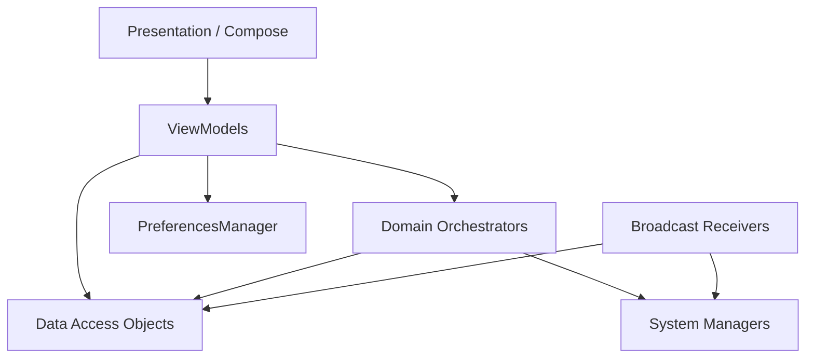

# CLASSMODE — ARCHITECTURE FORENSIC REVIEW

## OVERVIEW
The application claims a "Clean Architecture + MVVM" setup via its folder structure (`presentation/`, `domain/`, `data/`). However, the implementation violates several core Clean Architecture principles.

## DEPENDENCY GRAPH (ACTUAL)

## ARCHITECTURE VIOLATIONS

### 1. Direct Data Access from UI Layer
ViewModels (e.g., `LocationViewModel`, `ScheduleViewModel`) bypass the domain layer entirely and inject Room DAOs directly. 
* **Evidence**: `LocationViewModel.kt` invokes `geofenceDao.insertGeofence(entity)`.
* **Impact**: Domain business logic (like what happens when a schedule is deleted) is scattered across ViewModels rather than isolated in UseCases.

### 2. God Classes
`ContextEngine` and `AutomationOrchestrator` act as God Classes handling all automation logic. 
* **Evidence**: `ContextEngine` observes SharedPreferences, `ScheduleDao`, and `TriggerStateDao` simultaneously to synthesize a `ContextSnapshot`.
* **Impact**: Hard to test. Highly coupled.

### 3. Domain Logic Bypassing Data Layer
`RuleResolver.kt` ignores user-selected data.
* **Evidence**: `ScheduleEntity` contains a `SoundProfile` field. The UI populates this field. However, `RuleResolver` evaluates `SessionType.CLASS` and hardcodes `SoundProfile.VIBRATE`, entirely bypassing the data payload stored by the user.

### 4. Background Execution Leaks
`AutomationOrchestrator` is launched in a `CoroutineScope`.
* **Evidence**: It's called in `ClassModeApplication` via `GlobalScope` or similar application-level scope. If the process is killed, the orchestrator dies. Background transitions (like geofences) rely entirely on `GeofenceReceiver` spinning up a new coroutine to update the database, hoping the application scope orchestrator is still alive to observe the database change.

## LIFECYCLE & STATE
* **Duplicate Sources of Truth**: The UI reads `ScheduleEntity`, but automation reads `TriggerStateEntity` + `ScheduleEntity`. `GeofenceManager` uses Play Services as a 3rd source of truth. When a schedule is deleted, three separate systems must be manually kept in sync by the ViewModel.
* **Orphan Records**: If `GeofenceManager` fails to register a geofence due to permissions, the `GeofenceEntity` is still inserted into the database, leaving the DB out of sync with the OS.
